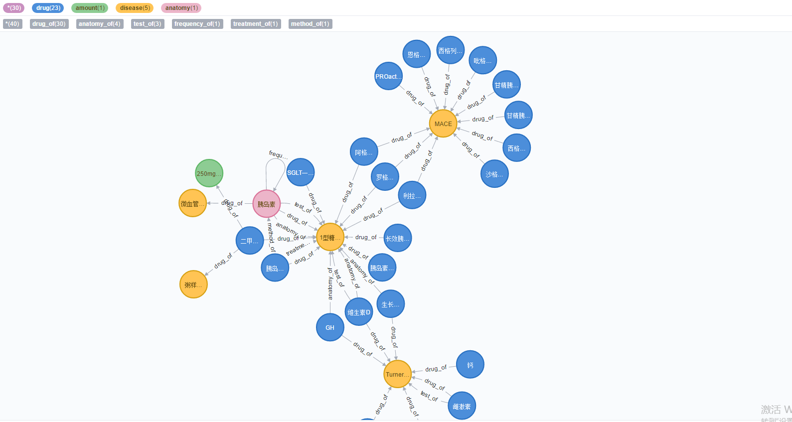
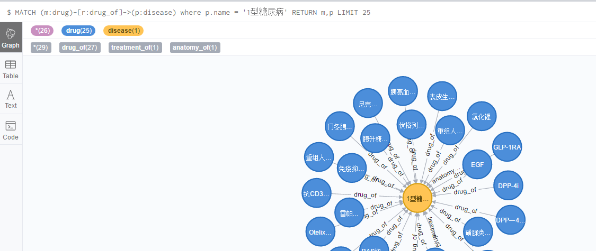

# disease_knowledge_graph
自己构建的一个简单的疾病知识图谱  
## 使用的数据
瑞金医院MMC人工智能辅助构建知识图谱大赛，里面提供的数据集，实体关系的定义已经给出，但需要自己抽取里面的实体与关系，并存储为导入neo4j可用的形式的数据集  
## 实体关系类别名称  
1、检查方法 -> 疾病（Test_Disease）  
2、临床表现 -> 疾病（Symptom_Disease）  
3、非药治疗 -> 疾病（Treatment_Disease）  
4、药品名称 -> 疾病（Drug_Disease）  
5、部位 -> 疾病（Anatomy_Disease）  
6、用药频率 -> 药品名称（Frequency_Drug）  
7、持续时间 -> 药品名称（Duration_Drug）  
8、用药剂量 -> 药品名称（Amount_Drug）  
9、用药方法 -> 药品名称（Method_Drug）  
10、不良反应 -> 药品名称（SideEff-Drug）	  
## 处理数据集脚本

process_data.py
## 导入数据脚本
导入数据脚本.txt
## 呈现效果

## 自己编写cypher语句并返回结果展示
1型糖尿病需要哪些药物治疗  
match (m:drug)-[r:drug_of]->(p:disease) where p.name = '1型糖尿病' return m,p

